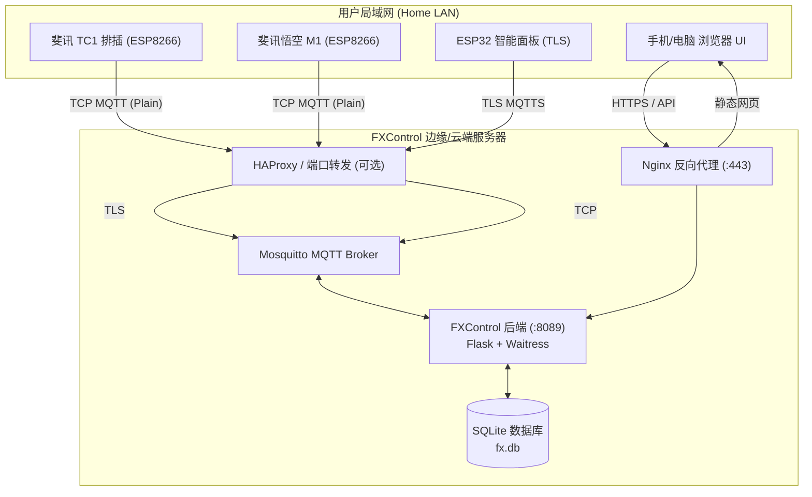

# 斐讯智能设备云端多用户管理平台 (Phicomm FXControl Hub)

<p align="center">
  
  
  
  
  
</p>

> [!IMPORTANT]
> ### ⚠️ 固件前置要求（接入前必须先刷固件）
> 本系统控制协议与数据通信**全面基于开源固件 [a2633063/zTC1](https://github.com/a2633063/zTC1)**（或基于其定制派生的固件版本）。
> **您的斐讯 TC1 智能排插 / 悟空 M1 设备在接入本项目平台前，必须先刷入该固件！**
> 未刷机的官方原厂出厂固件因协议加密和专有云端握手限制，无法与本平台建立 MQTT 连接。

**FXControl** 是一套专为斐讯（Phicomm）智能家居设备量身打造的开源**云端多用户智能物联网控制中枢**。全面支持**斐讯 TC1 六位智能排插**（zTC1）、**斐讯悟空 M1 空气检测仪**（zM1）以及各类定制 MQTT/TLS 智能面板。

平台采用现代响应式玻璃拟态（Glassmorphism）UI，提供多租户隔离、局域网设备自发现与一键认领、排插芯片级离线硬件定时、实时功率/PM2.5遥测监控、全网设备舰队治理等完整能力。

---

## 🌟 核心特性与架构亮点

### 1. 🔌 斐讯 TC1 智能排插全功能控制
* **6 路独立孔位通断**：支持单孔开关、总开、总关及状态秒级反馈。
* **插孔智能重命名**：可对 6 个插孔分别自定义别名（如“电视机”、“音响”、“路由器”等），并内置常用电器快捷选择标签。
* **排插芯片级硬件定时 (Hardware Offline Timers)**：
  * 支持 5 个独立定时任务槽位，直接将定时策略下发烧录至排插芯片；
  * **支持离线自动执行**：排插断网或断电重启后定时任务依然有效运行；
  * 支持 24 小时任意时间点、按星期周期重复（每天重复、工作日、周末或单次执行）。
* **实时遥测监控**：排插当前总功率（瓦特 W）、运行状态（待机/运行）、累计通电时间及心跳保活。
* **📡 近期通信报文透视**：设备卡片提供专属【📡 报文】按钮，可随时调出该设备最近 30 条 MQTT 通信报文（上行遥测与下发控制）。

### 2. 🍃 斐讯悟空 M1 空气质量实时遥测
* **核心环境指标监测**：高灵敏实时显示 PM2.5、甲醛（HCHO）、环境温度（℃）、相对湿度（%RH）。
* **屏幕远程调度**：支持一键远程休眠屏幕、点亮屏幕及 4 档亮度调节。
* **📡 近期通信报文透视**：同样支持一键查阅传感器遥测上报的历史报文。

### 3. 🛡️ 双模 TLS / 明文 TCP 自适应多路复用 (HAProxy Multiplexer)
* 针对 ESP8266 设备（TC1 / M1）原生仅支持明文 TCP，而 ESP32 现代面板采用 TLS 加密的难题，项目创新性引入 **HAProxy 嗅探多路复用器**：
* 在统一对外端口上，根据首包特征（`req_ssl_hello_type 1`）毫秒级自动分流：TLS 流量送至 SSL 引擎，明文 MQTT 流量送至原生监听器，实现**零配置透明接入**。

### 4. 👥 独立多租户隔离与安全防护
* **账号体系**：基于 JWT (JSON Web Token) 的无状态鉴权机制，每个用户仅能查看、控制自己绑定的设备。
* **防暴力注册与恶意刷号**：内置单 IP 注册频率限制与配额锁定机制。
* **局域网自发现与认领**：设备联网后，系统自动基于同网段探测未认领设备，支持单台添加或一键全部批量认领。

### 5. 👑 企业级管理后台 (Fleet Governance)
* **全景运营大盘**：用户总数、活跃状态、入网设备总量、在线设备占比与实时连接数。
* **全生命周期设备管理**：全网设备检索、型号过滤、绑定归属查询、强制解绑、一键过户转让。
* **深入用户设备详情透视**：在用户列表中点击任一用户或其设备数，直接呼出该用户**名下设备精简总览列表**（展示设备数量统计、在线/离线状态、最新一条收发 MQTT 报文摘要），并支持一键查看设备近期完整的 30 条 MQTT 通信历史日志。

---

## 🏛️ 系统拓扑与通信架构



---

## 🚀 快速上手与本地启动

### 方案 A：使用 Docker 一键启动（推荐）

```bash
# 1. 克隆代码仓库
git clone https://github.com/bigmasterpang/fxcontrol.git
cd fxcontrol

# 2. 复制环境变量模板并按需修改
cp .env.example .env

# 3. 启动全栈容器编排 (应用服务 + Mosquitto MQTT Broker)
docker compose up -d --build

# 访问控制平台：http://localhost:8089 或公网 http://your-ip:8089/fx/
```

#### 环境变量与 Docker 构建参数说明 (`.env`)

| 环境变量 / 构建参数 | 默认值 | 说明 |
| :--- | :--- | :--- |
| `HOST` | `0.0.0.0` | 后端服务绑定监听地址 |
| `PORT` | `8089` | 后端服务暴露端口 |
| `JWT_SECRET` | 随机默认值 | 用户登录凭据 JWT 签名密钥（生产环境请务必修改） |
| `MQTT_BROKER` | `mosquitto` | 容器内部连接的 MQTT Broker 地址（Docker 模式下指向 mosquitto 容器） |
| `MQTT_PORT` | `1883` | 内部 MQTT 端口 |
| `MQTT_PUBLIC_HOST` | *(留空)* | **对外展示的 MQTT 地址或域名**。留空时系统**自动根据访问当前页面的浏览器 Host 动态识别**；若配置了域名，系统会自动校验 DNS 解析与当前 IP 是否一致（见下文智能回退机制） |
| `MQTT_PUBLIC_PORT` | `1883` | 对外展示的 MQTT 通信端口 |
| `MQTT_USER` | `master` | MQTT 认证账号（展示在登录说明并用于设备与后端鉴权） |
| `MQTT_PASS` | `apple123` | MQTT 认证密码（展示在登录说明并用于设备与后端鉴权） |
| `DB_PATH` | `/app/data/fx.db` | SQLite 数据库存储路径（持久化挂载至 `./data` 目录） |
| `FX_ADMIN_USER` | `admin` | 初次启动自动初始化的超级管理员用户名 |
| `FX_ADMIN_PASS` | `admin123` | 初次启动初始化的管理员密码 |

在执行 `docker build` 镜像时，也可以直接作为构建变量传入：
```bash
docker build \
  --build-arg MQTT_PUBLIC_HOST=vm.dapang.wang \
  --build-arg MQTT_USER=master \
  --build-arg MQTT_PASS=apple123 \
  -t fxcontrol:latest .
```

---

### 🌐 平台说明动态 MQTT 参数与域名校验回退机制

平台登录页右侧的【平台使用说明与设备接入指南】卡片具备智能自适应能力：
1. **自动识别访问地址**：若未配置 `MQTT_PUBLIC_HOST`，前端自适应获取当前浏览器访问的主机名或 IP（例如访问 `http://106.14.225.57/fx/` 自动显示 `106.14.225.57`，内网访问自动显示 `192.168.8.1`）。
2. **域名 DNS 校验与智能回退机制（以 `vm.dapang.wang` 为例）**：
   - 当管理员在配置或环境变量中指定了自定义域名（例如 `vm.dapang.wang`，其实际解析公网 IP 为 `38.47.108.223`）：
   - 服务端会在后端通过本地及公网 DNS 实时探测该域名的 A 记录解析结果。
   - **若域名解析出的 IP 与当前服务器宿主机公网/局域网 IP 一致**（例如在生产服务器 `38.47.108.223` 上）：说明卡片中正常展示域名 `vm.dapang.wang`；
   - **若域名解析结果与当前服务器 IP 不符**（例如在独立公网测试服务器 `106.14.225.57` 或本地 PVE 上配置了该域名，或域名尚未解析）：系统将自动触发安全回退，**强行切换为当前服务器实际 IP**（如在测试服自动回退展示 `106.14.225.57`），并提示 `(域名不符，已切换为服务器 IP)`。此举能够彻底杜绝因填错域名或 DNS 劫持导致智能硬件配网后无法连入服务器的故障。
3. **参数一键复制与 UDP 报文生成**：
   - 服务器地址、端口、账号（`master`）、密码（`apple123`）均提供快捷一键复制按钮（📋）；
   - 提供【📋 复制设备 UDP 配置 JSON】按钮，点击即可直接得到格式化好的配网 JSON，配合配网脚本使用。
4. **后台热更新**：管理员可在后台【安全与策略设置】中随时修改 MQTT 展示地址与账密，保存后无需重启容器，即时生效。

---

### 🔒 SSL / TLS 证书配置最佳实践（容器内 vs 外部 Nginx）

> **核心建议**：**强烈推荐在【外部 Nginx】（宿主机）中配置 SSL 证书，而不是在 Docker 容器内部。**

#### 1. 为什么采用外部 Nginx 代理（TLS 终结）？
* **关注点分离**：容器专注于轻量业务逻辑（HTTP 8089 + MQTT 1883），镜像通用、易移植且无证书文件污染。
* **证书自动续签零中断**：宿主机使用 Certbot 或 acme.sh 自动续签 Let's Encrypt 证书后，仅需毫秒级 `systemctl reload nginx`，**完全无需重启容器或中断设备连接**。
* **高性能**：宿主机 Nginx 原生处理 TLS 握手、HTTP/2、TLS 1.3 及会话缓存（SSL Session Cache）性能更优。

#### 2. 外部 Nginx 完整配置范例

##### (1) Web 界面与 API 的 HTTPS (443) 反向代理
在宿主机 `/etc/nginx/conf.d/fxcontrol.conf` 中添加：
```nginx
server {
    listen 443 ssl http2;
    listen 80;
    server_name your-domain.com 106.14.225.57;

    # SSL 证书路径（例如 Let's Encrypt 证书）
    ssl_certificate     /etc/letsencrypt/live/your-domain.com/fullchain.pem;
    ssl_certificate_key /etc/letsencrypt/live/your-domain.com/privkey.pem;

    ssl_protocols TLSv1.2 TLSv1.3;
    ssl_ciphers HIGH:!aNULL:!MD5;

    # 反向代理至 FXControl 容器 (支持根路径或 /fx/ 子路径)
    location /fx/ {
        proxy_pass http://127.0.0.1:8089;
        proxy_set_header Host $host;
        proxy_set_header X-Real-IP $remote_addr;
        proxy_set_header X-Forwarded-For $proxy_add_x_forwarded_for;
        proxy_set_header X-Forwarded-Proto https;
        proxy_http_version 1.1;
        proxy_read_timeout 300s;
        proxy_send_timeout 300s;
    }
}
```

##### (2) MQTT 客户端 TLS 加密端口 (8883) 终结
若需设备通过 8883 端口安全加密接入，使用 Nginx 的 `stream` 模块在外部终结 TLS，解密后转发给容器内的 Mosquitto 1883 端口：
在 `/etc/nginx/nginx.conf` 中配置：
```nginx
stream {
    server {
        listen 8883 ssl;
        ssl_certificate     /etc/letsencrypt/live/your-domain.com/fullchain.pem;
        ssl_certificate_key /etc/letsencrypt/live/your-domain.com/privkey.pem;
        ssl_protocols TLSv1.2 TLSv1.3;

        proxy_pass 127.0.0.1:1883;
        proxy_timeout 1h;
        proxy_connect_timeout 10s;
    }
}
```

##### (3) WebSockets WSS (443 /mqtt) 代理
若网页客户端需通过加密 WebSocket 直连 MQTT：
```nginx
location /mqtt {
    proxy_pass http://127.0.0.1:9001;
    proxy_http_version 1.1;
    proxy_set_header Upgrade $http_upgrade;
    proxy_set_header Connection "Upgrade";
    proxy_set_header Host $host;
}
```

---

### 方案 B：传统 Python 独立运行

```bash
# 1. 安装 Python 依赖
pip install -r requirements.txt

# 2. 初始化管理员账号 (默认用户名 admin / 密码 admin123)
python scripts/init_admin.py --username admin --password "admin123"

# 3. 启动后端服务器
python server/app.py
```

访问 `http://localhost:8089` 即可打开完整控制前端。

---

## 📡 斐讯设备 MQTT 与 UDP 通信协议

### 1. 局域网 UDP 广播一键配网 (`10182` 端口)
向局域网广播地址（如 `192.168.8.255:10182`）发送 JSON 报文即可配置设备：

> [!TIP]
> **广播配网目标地址一致性要求**：
> 配网报文中的 `mqtt_uri`（MQTT 服务器地址）**必须与平台前台说明卡片中展示的有效地址（校验通过的域名如 `vm.dapang.wang` 或回退后的服务器 IP）严格保持一致**！如果配置了域名但尚未生效（页面回退显示为服务器 IP），配网请直接使用该 IP，确保局域网广播配网一次性成功。

```json
{
  "mac": "d0bae46448c0",
  "setting": {
    "mqtt_uri": "vm.dapang.wang",
    "mqtt_port": 1883,
    "mqtt_user": "master",
    "mqtt_password": "apple123"
  }
}
```

本项目自带批量配置脚本：
```bash
python scripts/configure_devices_udp.py --broker vm.dapang.wang --port 1883 --user master --password apple123
```

### 2. 斐讯 TC1 排插 MQTT 协议规范
* **遥测与状态上报**：`device/ztc1/{mac}/state`
  ```json
  {
    "mac": "d0bae46448c0",
    "plugs": [1, 0, 1, 0, 0, 0],
    "power": "18.5",
    "total_time": 36000
  }
  ```
* **孔位通断下发**：`device/ztc1/{mac}/set`
  ```json
  {
    "mac": "d0bae46448c0",
    "plug_0": {"on": 1},
    "plug_1": {"on": 0}
  }
  ```
* **硬件离线定时下发**：`device/ztc1/{mac}/set`
  ```json
  {
    "mac": "d0bae46448c0",
    "task_0": {
      "plug": 0,
      "hour": 8,
      "minute": 30,
      "repeat": 127,
      "action": 1
    }
  }
  ```

### 3. 斐讯悟空 M1 检测仪 MQTT 协议规范
* **传感器环境遥测**：`device/zm1/{mac}/state`
  ```json
  {
    "mac": "b0f89323ef25",
    "pm25": 15,
    "hcho": 0.02,
    "temperature": 25.3,
    "humidity": 52.0,
    "screen_on": 1,
    "brightness": 2
  }
  ```
* **屏幕控制指令**：`device/zm1/{mac}/set`
  ```json
  {
    "mac": "b0f89323ef25",
    "brightness": 3
  }
  ```

---

## 📂 项目工程目录结构

```text
fxcontrol/
├── .github/                 # GitHub CI / Action 配置
├── .env.example             # 环境变量模版配置
├── .gitignore               # Git 忽略项
├── Dockerfile               # 容器化镜像构建文件
├── docker-compose.yml       # Docker 编排配置
├── LICENSE                  # MIT 开源许可证
├── README.md                # 中文项目说明文档
├── README_EN.md             # 英文项目说明文档
├── requirements.txt         # Python 依赖清单
├── server/
│   ├── app.py               # Flask / Waitress 云端控制中枢 API 与 MQTT Bridge
│   ├── models.py            # SQLite 数据库模型与多租户权限封装
│   └── static/
│       └── index.html       # 现代化响应式前端 SPA（包含控制台、发现、管理后台）
├── deploy/
│   ├── haproxy/
│   │   └── haproxy.cfg      # HAProxy 端口 TLS/TCP 智能多路复用配置模版
│   ├── mosquitto/
│   │   └── mqtt.conf        # Mosquitto MQTT Broker 配置文件
│   ├── nginx/
│   │   └── fx.conf          # Nginx 反向代理与 HTTPS 配置文件
│   └── systemd/
│       └── fx-manager.service # Linux systemd 生产守护进程服务模版
└── scripts/
    ├── configure_devices_udp.py # 局域网 UDP 一键配网与 MQTT 指令下发脚本
    └── init_admin.py        # 管理员密码创建/重置命令行脚本
```

---

## 🔒 安全与隐私实践

1. **凭据安全**：生产部署时，请务必在 `.env` 中更换默认的 `JWT_SECRET` 与管理员密码；
2. **限流保护**：全站自主注册开关与单 IP 限流逻辑可在管理后台【安全与全站策略】中随时调整；
3. **隔离机制**：用户间设备 MAC 唯一绑定，非当前所有者无法下发控制指令。

---

## 📄 开源许可证 (License)

本项目遵循 [MIT License](LICENSE) 开源协议。欢迎提交 Issue 与 Pull Request 共同改进！
